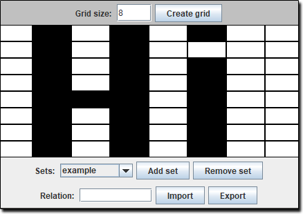

# Weka Data Generator



[](https://forthebadge.com)

A simple tool to assist with optical character recognition in Weka  
The tool allows users to draw alphanumeric characters and shapes  
Then generate and export the represented drawing in a Weka [ARFF](https://www.cs.waikato.ac.nz/ml/weka/arff.html) file

#### Example ARFF
The tool generates the ARFF instance data and header with a specified relation  
and class attribute name as well as the binary pixel attributes  where each attribute  
is associated with a pixel on the grid and consequently, a true value indicates the selection of the pixel

```
@RELATION exampleRelation

@ATTRIBUTE pixel00 {0,1}
@ATTRIBUTE pixel01 {0,1}
@ATTRIBUTE pixel02 {0,1}
@ATTRIBUTE pixel03 {0,1}

....

@DATA  
0,1,0,1,0,1,0,0,0,1,0,1,0,0,0,0,0,1,0,1,0,1,0,0,0,1,0,1,0,1,0,  
0,0,1,1,1,0,1,0,0,0,1,0,1,0,1,0,0,0,1,0,1,0,1,0,0,0,1,0,1,0,1,0,0,example
```

### Requirements
- JRE 1.8 (Running only)
- JDK 1.8 (Building & Running)

### Installation
- [Download](https://github.com/kyleruss/weka-data-generator/releases/latest) the latest release
- Unzip the contents in an appropriate directory
- Run `WekaDataGenerator.exe`

### License
This project is available under the MIT License  
See [LICENSE](LICENSE) for more details
